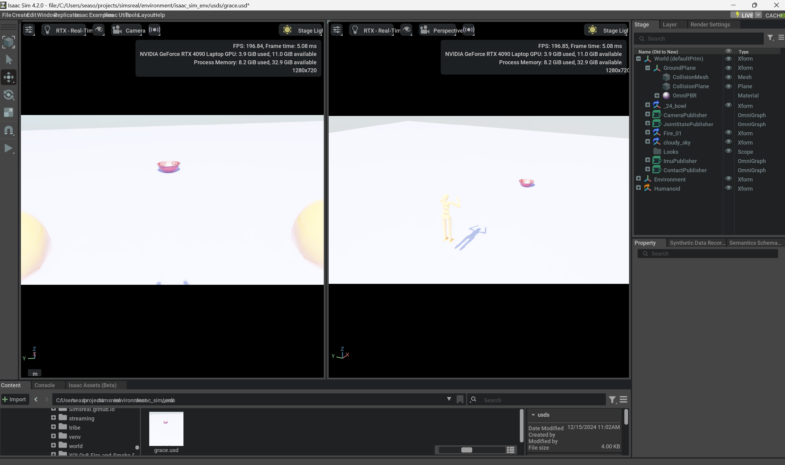

[](https://join.slack.com/t/simsreal/shared_invite/zt-2vwyklm9d-ppni~ex4pc4~t~5sBGpwFw)
[](https://simsreal.atlassian.net/jira/software/c/projects/SR/boards/4?assignee=712020%3Acbb6a13b-ccf1-4d9d-8f59-7c4584c2d4ca)
## Table of Contents
- [Prerequisites](#prerequisites)
  - [Clone the repository](#clone-the-repository)
  - [Install development packages](#install-development-packages)
  - [Install NVIDIA Isaac Sim](#install-nvidia-isaac-sim)
  - [Install ROS2 Humble](#install-ros2-humble)
  - [Install Prometheus and Grafana](#install-prometheus-and-grafana)
- [Start Simsreal](#start-simsreal)

## Prerequisites

### Clone the repository
The easiest way to clone the repository is to create a ssh key and use it to clone the repository through ssh.
```bash
export SSHKEY=~/.ssh/id_ed25519_second
export GIT_SSH_COMMAND="ssh -i $SSHKEY"
git clone git@github.com:Simsreal/simsreal.git
git submodule update --init --recursive
git pull --recurse-submodules
```

| Submodule | Description |
|-----------|-------------|
| simsreal | Main repo |
| environment | 3D physics-based simulation environment, ROS2 bridge builds. Robot/ world configurations |
| intelligence | The foundations for consciousness, abstract classes as references when developing intelligence |
| human | Primarily focused development of intelligence in Simsreal |
| neuro_symbol | High-level symbolic reasoning for humans to reason and create actions from granular behaviors |
| web | Streamlit web app |
| utilities | Utility functions |

### Install development packages
```bash
pip install -r requirements-dev.txt
chmod +x setup.sh
./setup.sh
```

### Install NVIDIA Isaac Sim
Please install Isaac Sim version `4.2.0` for development.
Follow [official documentation](https://docs.omniverse.nvidia.com/isaacsim/latest/installation/install_workstation.html) to install Omniverse and Isaac Sim.

### Install ROS2 Humble
Please install ROS2 Humble for development.
Follow [official documentation](https://docs.omniverse.nvidia.com/isaacsim/latest/installation/install_ros.html) to install ROS2 Humble.

### Install Prometheus and Grafana
(Optional) Prometheus and grafana are used to visualize intelligence's metrics and context. Refer to [docs/prometheus_grafana.md](docs/prometheus_grafana.md) for more details.

## Launch Simsreal
### Isaac-sim
Start NVIDIA Isaac Sim and loads environments. Check existing worlds (`.usd` files) in [here](./environment/isaac_sim_env/usds/), and import one of them. Alternatively, if you are familiar with Isaac Sim, you can create your own world with action graphs and ROS2 bridge.

Sample world of `grace.usd`:


### Simsreal
The backend of Simsreal handles the consciousness emergence.
```bash
# isaac-sim
python host.py --config isaac/grace

# there is grid2d world for testing as well:
python host.py --config grid_2d/felix
```

To understand the flow, you can have a look at high-level flowchart in [here](./human/)
